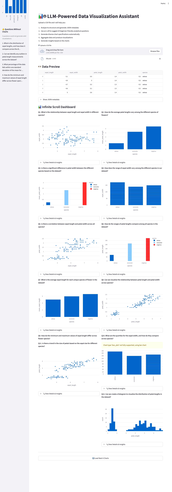

# LLM-Powered Data Visualization Assistant

<p align="center">
  
</p>

<p align="center"><i>Automated insights and visualizations powered by large language models.</i></p>

<p align="center">
  
  
  
  
  
  
</p>

## 🚀 Overview

This project implements an end-to-end **LLM-assisted data visualization pipeline** that converts **raw CSV files** into **automatically generated charts and insights**.

It is designed to help non-expert users explore datasets without writing code.

## ✨ Key Features

- 📁 **Upload any CSV**  
- 🧠 **LLM-generated analysis questions** based on your dataset  
- 📊 **Automatic visualization specs** (chart types, encodings, aggregations)  
- 🔧 **Python-rendered charts** using Matplotlib & Plotly  
- 💬 **Natural-language insights** generated for every chart  
- 🖥 **Interactive Streamlit dashboard** with infinite scrolling  
- 🟦 **FastAPI backend** for programmatic access  


## 👥 Team

- **Ning Li** — <a href="https://github.com/ritaliiii">GitHub</a>
- **Qian Li** — <a href="https://github.com/summereth">GitHub</a>
- **Xihe Mu** — <a href="https://github.com/moksaiho">GitHub</a>

## 🗂 Project Structure

```
final_project/
├─ app.py                 
├─ ui_app.py              
├─ src/
│  └─ datapipe/
│     ├─ json_schema.py
│     ├─ llm_questions.py
│     ├─ llm_chart_spec.py
│     ├─ viz_executor.py
│     ├─ insight.py
│     ├─ style_refiner.py
│     ├─ pipeline.py
│     └─ __init__.py
├─ assets/
│  └─ snapshot/
│     ├─ 1.png
│     └─ 2.png
└─ data/
```

## 🧩 Pipeline Overview

1. **CSV → JSON Metadata**  
2. **LLM → Dataset exploration questions**  
3. **User selects a question**  
4. **LLM → Chart specification**  
5. **Python → Visualization rendering**  
6. **LLM → Natural-language insights**  
7. **Streamlit → Interactive dashboard UI**

## 📦 Installation

### 1. Create environment

```bash
conda create -p ./venv python=3.11
conda activate ./venv
```

### 2. Install dependencies

```bash
pip install -r requirements.txt
```

### 3. Add API key

Create `.env`:

```
OPENAI_API_KEY=your_key_here
```

## ▶️ Run Backend API

```bash
uvicorn app:app --reload
```

Docs:  
http://127.0.0.1:8000/docs

## ▶️ Run Streamlit UI

```bash
streamlit run ui_app.py
```

## 🎥 Demo Video

[](https://youtu.be/lau9mDBBHn4)

## 🖼 Screenshots

### Prototype  


### Updated Infinite Scroll Dashboard  


## 📝 Reflection

There are limitations in the evaluation process—both in the level of domain expertise required and in the inherent subjectivity of interpreting visualizations. These factors may influence scoring and highlight the need for more systematic evaluation mechanisms.

## 📌 Future Work

- Support more chart types  
- Add guardrails for incorrect LLM chart specs  
- Add dataset summary statistics  
- Improve pipeline robustness  

