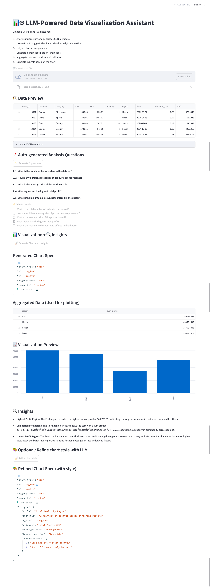

# LLM-Powered Data Visualization Assistant

This project is a small end-to-end pipeline that turns **raw CSV uploads** into **LLM-assisted data visualizations**.

The goal is to help non-expert users explore their data by:

1. Structuring the uploaded CSV into a **JSON metadata schema**
2. Asking an LLM to propose **analysis questions** about the dataset
3. Letting the user pick one question
4. Asking the LLM to produce a **chart specification** (`chart_spec`)
5. Executing the chart spec in Python to **aggregate data and render a chart**
6. Asking the LLM to generate **natural language insights** for the chart

There are two main entry points:

- A **FastAPI backend** for programmatic access (`app.py`)
- A **Streamlit demo UI** for interactive exploration (`ui_app.py`)

## Project Structure

```
final_project/
├─ app.py
├─ ui_app.py
├─ src/
│  ├─ __init__.py
│  └─ datapipe/
│     ├─ json_schema.py
│     ├─ viz_executor.py
│     ├─ insight.py
│     ├─ llm_questions.py
│     └─ llm_chart_spec.py
├─ notebooks/
└─ data/
```

## Environment Setup

### Create conda env

```
conda create -p ./venv python=3.11
conda activate ./venv
```

### Install dependencies

```
pip install fastapi uvicorn streamlit openai python-dotenv pandas matplotlib plotly
```

### `.env` file

```
OPENAI_API_KEY=your_key_here
```

## Run API

```
uvicorn app:app --reload
```

Docs at: http://127.0.0.1:8000/docs

## Run Streamlit UI

```
streamlit run ui_app.py
```

## Pipeline Overview

1. CSV → JSON metadata
2. Metadata → LLM-generated questions
3. User picks question
4. LLM → chart spec
5. Python → aggregated data + plot
6. LLM → insights

## Demo Screenshot

Below is the full workflow of the Streamlit data visualization assistant:


